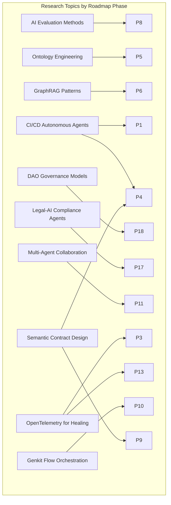

```mermaid
graph TD
    subgraph Research Topics by Roadmap Phase
        RP1[AI Evaluation Methods] --> P8
        RP2[Ontology Engineering] --> P5
        RP3[GraphRAG Patterns] --> P6
        RP4[CI/CD Autonomous Agents] --> P1 & P4
        RP5[DAO Governance Models] --> P18
        RP6[Legal-AI Compliance Agents] --> P17
        RP7[Multi-Agent Collaboration] --> P11
        RP8[OpenTelemetry for Healing] --> P3 & P13
        RP9[Genkit Flow Orchestration] --> P10
        RP10[Semantic Contract Design] --> P4 & P9
    end
```
