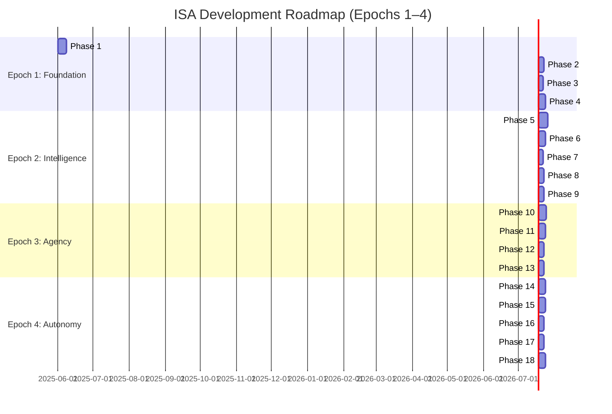

```mermaid
gantt
    title ISA Development Roadmap (Epochs 1–4)
    dateFormat  YYYY-MM-DD
    section Epoch 1: Foundation
    Phase 1: Core Infrastructure       :a1, 2025-06-01, 7d
    Phase 2: Security & Secrets        :a2, after a1, 5d
    Phase 3: Observability             :a3, after a2, 4d
    Phase 4: Self-Healing Docs (Monitor) :a4, after a1, 6d

    section Epoch 2: Intelligence
    Phase 5: KG Core                   :b1, after a4, 8d
    Phase 6: GraphRAG                  :b2, after b1, 6d
    Phase 7: Explainable AI            :b3, after b2, 4d
    Phase 8: AI Evaluation             :b4, after b3, 5d
    Phase 9: Self-Healing Docs (Plan)  :b5, after b4, 5d

    section Epoch 3: Agency
    Phase 10: Agentic Workflows        :c1, after b5, 7d
    Phase 11: Multi-Agent Systems      :c2, after c1, 6d
    Phase 12: Automated Red Teaming    :c3, after b4, 5d
    Phase 13: Self-Healing Code        :c4, after c2, 5d

    section Epoch 4: Autonomy
    Phase 14: Autonomous Knowledge     :d1, after c2, 6d
    Phase 15: Dynamic Workflow Gen     :d2, after c1, 6d
    Phase 16: GS1 Integration          :d3, after d1, 5d
    Phase 17: Compliance Evolution     :d4, after d1, 5d
    Phase 18: DAO Governance           :d5, after d3, 6d
```
