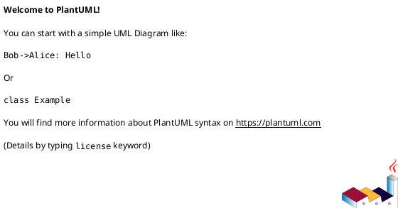

# Section 02: System Architecture & Design

This section describes the complete technical architecture of the Intelligent Standards Assistant (ISA), including its components, their interactions, the technologies employed, and key design patterns. It serves as the foundational blueprint for all development and integration efforts.

## 2.1. Overview

(High-level architectural vision, key technology choices. To be populated by Roo via `TASK-P0-M0.1-T003` and subsequent tasks.)

## 2.2. Component Breakdown

This subsection details the major logical and physical components of the ISA system.

### 2.2.1. Component: [ComponentName]

-   **ID:** `COMP-XXX`
-   **Purpose:** ...
-   **Technologies:** (e.g., Next.js, TypeScript, Genkit, Firestore)
-   **Key Responsibilities:** ...
-   **Interfaces/APIs:** (Defined using OpenAPI snippets, GraphQL schema links, or structured descriptions)
    ```yaml
    # Example API Interface for COMP-001
    api_id: "API-COMP-001-v1"
    protocol: "REST"
    endpoint_base: "/api/v1/component_one"
    # Further OpenAPI details or link to full spec
    ```
-   **Dependencies:** (List of other ComponentIDs)
-   **OwnerRooMode (for development/maintenance):** (e.g., "BuildMode/Frontend", "AIMode/FlowDevelopment")

## 2.3. Data Flow Diagrams

(Embedded diagrams showing data movement between components. To be populated by Roo.)



## 2.4. Infrastructure Overview

(Description of cloud services, networking, deployment strategy - e.g., Firebase App Hosting config summary, links to Terraform modules in `iam_infra/`. To be populated by Roo via `TASK-P0-M0.1-T001` and `TASK-P0-M0.1-T006`.)

## 2.5. Core System Tools & Capabilities

This subsection defines the conceptual Genkit tools and other core system capabilities that Roo Modes will utilize to perform their operations. These are the programmatic interfaces to underlying functionalities.

### 2.5.1. Tool: `fileSystemAccessTool` (v1.1 - MCP Focused)

-   **`name`**: `"fileSystemAccessTool"`
-   **`description`**: "Interacts with a scoped MCP file system server to perform operations like reading files, writing files, listing directory contents, and creating directories within allowed project paths (e.g., UDM, logs, state). All paths are relative to a pre-configured project root for safety."
-   **`input_schema` (JSON Schema):**
    ```json
    {
      "type": "object",
      "properties": {
        "action": {
          "type": "string",
          "enum": [
            "readFile",
            "writeFile",
            "listFiles",
            "listDirectories",
            "createDirectory",
            "deleteFile",
            "checkExists"
          ],
          "description": "The file system action to perform."
        },
        "filePath": {
          "type": "string",
          "description": "The path to the file or directory, relative to the project's UDM/operational root. Must be sanitized and validated against allowed paths."
        },
        "content": {
          "type": "string",
          "optional": true,
          "description": "Content to write for 'writeFile' action."
        },
        "encoding": {
          "type": "string",
          "enum": ["utf8", "base64"],
          "optional": true,
          "default": "utf8",
          "description": "Encoding for readFile/writeFile."
        },
        "recursive": {
          "type": "boolean",
          "optional": true,
          "default": false,
          "description": "For 'createDirectory', create parent directories if they don't exist. For 'listFiles', list recursively (use with depth limit)."
        },
        "maxDepth": {
          "type": "integer",
          "optional": true,
          "default": 1,
          "description": "For recursive 'listFiles', max depth to scan."
        }
      },
      "required": ["action", "filePath"]
    }
    ```
-   **`output_schema` (JSON Schema):**
    ```json
    {
      "type": "object",
      "properties": {
        "actionPerformed": {
          "type": "string",
          "description": "Mirrors input action."
        },
        "filePathTargeted": {
          "type": "string",
          "description": "The path that was targeted by the action."
        },
        "status": {
          "type": "string",
          "enum": [
            "SUCCESS",
            "ERROR_PATH_NOT_FOUND",
            "ERROR_PERMISSION_DENIED",
            "ERROR_INVALID_PATH",
            "ERROR_WRITE_FAILED",
            "ERROR_READ_FAILED",
            "ERROR_MCP_SERVER_UNAVAILABLE",
            "ERROR_UNKNOWN"
          ],
          "description": "Status of the file system operation."
        },
        "fileExists": {
          "type": "boolean",
          "optional": true,
          "description": "Result for 'checkExists' action."
        },
        "fileContent": {
          "type": ["string", "null"],
          "optional": true,
          "description": "Content of the file for 'readFile' action (null if error or not applicable)."
        },
        "directoryContents": {
          "type": "array",
          "items": {
            "type": "object",
            "properties": {
              "name": { "type": "string" },
              "type": { "type": "string", "enum": ["file", "directory"] }
            },
            "required": ["name", "type"]
          },
          "optional": true,
          "description": "List of files/directories for 'listFiles' or 'listDirectories' actions."
        },
        "errorDetails": {
          "type": ["string", "null"],
          "description": "Details if the status indicates an error. Null if no error."
        }
      },
      "required": ["actionPerformed", "filePathTargeted", "status"]
    }
    ```
-   **High-Level Implementation Notes:**
    *   **MCP Client Integration:** This Genkit tool will internally use an `mcpClient` (like `genkitx-mcp`) configured to connect to a specific MCP server instance.
    *   The MCP server itself (e.g., `npx -y @mcp/filesystem-server` or a similar custom implementation) would be configured with `ALLOWED_DIRS` to strictly limit its access to project directories like `/docs/udm/`, `/logs/`, `/state/`, `/prompts/`. This MCP server could be run locally by Roo or as a tightly controlled sidecar/local service.
    *   **Path Sanitization & Validation:** **CRITICAL.** All `filePath` inputs must be:
        *   Normalized (e.g., resolve `..`).
        *   Validated to ensure they fall within the `ALLOWED_DIRS` configured for the backing MCP server. Path traversal attempts must be blocked.
        *   The Genkit tool itself should perform this validation before sending requests to the MCP server, as an added safety layer.
    *   **Action Mapping:** The `action` in the input schema will map to specific actions/commands supported by the MCP filesystem server (e.g., `readFile` might map to a `filesystem/read_file` message with appropriate parameters).
    *   **Error Handling:** Robustly handle errors from the `mcpClient` (e.g., MCP server unavailable, permissions errors from the MCP server itself) and translate them into the `output_schema`'s `status` and `errorDetails`.
    *   **Security:** The security of this tool relies heavily on the correct and strict configuration of the backing MCP filesystem server's `ALLOWED_DIRS` and its own path validation logic. The `deleteFile` action should be used with extreme caution and perhaps require special confirmation flags or be disabled by default in most configurations.
    *   **Configuration:** UDM Section `06-Operational-Config.md` will need to specify how the MCP client within this Genkit tool is configured, and how the MCP filesystem server itself is launched, configured (with `ALLOWED_DIRS`), and managed by Roo.
    *   **Node.js `fs` Best Practices (from Research):** The underlying implementation of the MCP server's file system operations should adhere to Node.js `fs.promises` best practices, including:
        *   Prioritizing asynchronous operations (`fs.promises` API).
        *   Using `path.join`, `path.resolve`, `path.normalize` for reliable path manipulation.
        *   Implementing multi-step path validation (trusted base directory, resolve against base, verify containment) to prevent path traversal vulnerabilities.
        *   Comprehensive error handling for common `fs` error codes (`ENOENT`, `EACCES`, `EPERM`, `EISDIR`, `ENOTDIR`, `EEXIST`, `EBUSY`, `ENOTEMPTY`).
        *   Considering streams (`fs.createReadStream`, `fs.createWriteStream`, `stream.promises.pipeline`) for large files to ensure memory efficiency and performance.

### 2.5.2. Tool: `WebSearchTool`

-   **`name`**: `"webSearchTool"`
-   **`description`**: "Performs a web search for a given query and returns a list of relevant search results (titles, links, snippets). Useful for discovering external information."
-   **`input_schema` (JSON Schema):**
    ```json
    {
      "type": "object",
      "properties": {
        "query": {
          "type": "string",
          "description": "The search query string."
        },
        "numResults": {
          "type": "integer",
          "description": "Optional. The maximum number of search results to return. Default: 5.",
          "default": 5,
          "optional": true
        },
        "site": {
          "type": "string",
          "description": "Optional. Restrict search to a specific domain (e.g., 'docs.anthropic.com').",
          "optional": true
        }
      },
      "required": ["query"]
    }
    ```
-   **`output_schema` (JSON Schema):**
    ```json
    {
      "type": "object",
      "properties": {
        "status": {
          "type": "string",
          "enum": ["SUCCESS", "ERROR_API_FAILURE", "ERROR_RATE_LIMIT", "ERROR_UNKNOWN"],
          "description": "Status of the web search operation."
        },
        "results": {
          "type": "array",
          "items": {
            "type": "object",
            "properties": {
              "title": { "type": "string" },
              "link": { "type": "string", "format": "url" },
              "snippet": { "type": "string" }
            },
            "required": ["title", "link", "snippet"]
          },
          "description": "Array of search results."
        },
        "errorDetails": {
          "type": ["string", "null"],
          "description": "Details if the status indicates an error. Null if no error."
        }
      },
      "required": ["status", "results", "errorDetails"]
    }
    ```
-   **High-Level Implementation Notes:**
    *   This tool will likely integrate with an external search API (e.g., Google Custom Search API, SerpApi, or a similar service).
    *   API key management for the search service needs to be handled securely (UDM Section 06).
    *   Implement robust error handling for API failures, rate limits, and network issues.
    *   Consider cost implications of search queries.

### 2.5.3. Tool: `DocumentFetchingParsingTool`

-   **`name`**: `"documentFetchingParsingTool"`
-   **`description**": "Fetches content from a given URL (HTML, PDF, plain text) or a local file path, and extracts its main textual content. Can optionally focus on specific sections or limit content length."
-   **`input_schema` (JSON Schema):**
    ```json
    {
      "type": "object",
      "properties": {
        "url": {
          "type": "string",
          "format": "url",
          "description": "The URL of the document to fetch and parse. Mutually exclusive with 'filePath'."
        },
        "filePath": {
          "type": "string",
          "description": "The local file path of the document to read and parse. Mutually exclusive with 'url'.",
          "optional": true
        },
        "documentTypeHint": {
          "type": "string",
          "enum": ["html", "pdf", "text", "markdown"],
          "description": "Optional hint about the document type to guide parsing. If not provided, attempts to infer.",
          "optional": true
        },
        "maxLengthBytes": {
          "type": "integer",
          "description": "Optional. Maximum number of bytes to extract from the document. Useful for very large documents. Default: 500000 (0.5MB).",
          "default": 500000,
          "optional": true
        },
        "sectionKeywords": {
          "type": "array",
          "items": { "type": "string" },
          "description": "Optional. Keywords to prioritize when extracting content, focusing on relevant sections.",
          "optional": true
        }
      },
      "oneOf": [{"required": ["url"]}, {"required": ["filePath"]}]
    }
    ```
-   **`output_schema` (JSON Schema):**
    ```json
    {
      "type": "object",
      "properties": {
        "status": {
          "type": "string",
          "enum": ["SUCCESS", "PARTIAL_SUCCESS_TRUNCATED", "ERROR_FETCH_FAILED", "ERROR_UNSUPPORTED_FORMAT", "ERROR_PARSE_FAILED", "ERROR_INVALID_INPUT", "ERROR_UNKNOWN"],
          "description": "Status of the document fetching and parsing operation."
        },
        "urlFetched": {
          "type": "string",
          "format": "url",
          "optional": true,
          "description": "The URL that was successfully fetched, if applicable."
        },
        "filePathProcessed": {
          "type": "string",
          "optional": true,
          "description": "The local file path that was successfully processed, if applicable."
        },
        "contentTypeDetected": {
          "type": "string",
          "description": "The detected content type (e.g., 'text/html', 'application/pdf').",
          "optional": true
        },
        "extractedTitle": {
          "type": "string",
          "optional": true,
          "description": "The title of the document, if extractable."
        },
        "cleanedTextContent": {
          "type": ["string", "null"],
          "description": "The main textual content extracted from the document, cleaned of boilerplate (null if error or no text extracted)."
        },
        "metadata": {
          "type": "object",
          "description": "Additional metadata about the document or extraction process (e.g., original_size_bytes, truncation_applied).",
          "additionalProperties": true
        },
        "errorDetails": {
          "type": ["string", "null"],
          "description": "Details if the status indicates an error. Null if no error."
        }
      },
      "required": ["status", "metadata", "errorDetails"]
    }
    ```
-   **High-Level Implementation Notes:**
    *   **Fetching:** Use Node.js `fetch` API or a robust HTTP client for URLs. For local files, use `fileSystemAccessTool` (or its underlying `fs.promises`).
    *   **Parsing:**
        *   HTML: Use libraries like `jsdom` with `@mozilla/readability` to extract main article content, stripping boilerplate.
        *   PDF: Use a PDF parsing library (e.g., `pdf-parse`).
        *   Markdown/Text: Direct read.
    *   **Content Cleaning:** Remove extraneous whitespace, navigation, ads, etc.
    *   **Error Handling:** Robustly handle network errors, unsupported formats, parsing failures, and timeouts.
    *   **Security:** Be cautious with arbitrary URLs; consider allowlists if used in a sensitive context.
    *   **Memory/Performance:** For very large documents, consider streaming approaches or chunking if `maxLengthBytes` is large.

### 2.5.4. Tool: `Context7DocumentationTool`

-   **`name`**: `"context7DocumentationTool"`
-   **`description`**: "Queries a Context7 MCP Server to find Context7-compatible IDs for given library names and then fetches documentation for those libraries. Can optionally focus on specific topics within the library's documentation and request a maximum number of tokens for the returned content. Useful for getting up-to-date, version-specific documentation and code examples for various software libraries."
-   **`input_schema` (JSON Schema):**
    ```json
    {
      "type": "object",
      "properties": {
        "action": {
          "type": "string",
          "enum": ["resolve_library_id", "get_library_docs"],
          "description": "The action to perform: either resolve a library name to an ID, or get documentation for a known ID."
        },
        "libraryName": {
          "type": "string",
          "optional": true,
          "description": "The common name of the library to search for (e.g., 'Next.js', 'React', 'langchain'). Required if action is 'resolve_library_id'."
        },
        "context7CompatibleLibraryID": {
          "type": "string",
          "optional": true,
          "description": "The exact Context7-compatible library ID (e.g., '/vercel/next.js', '/mongodb/docs'). Required if action is 'get_library_docs'."
        },
        "topic": {
          "type": "string",
          "optional": true,
          "description": "Optional. Focus the documentation retrieval on a specific topic within the library (e.g., 'routing', 'hooks', 'authentication')."
        },
        "maxTokens": {
          "type": "integer",
          "optional": true,
          "default": 10000,
          "description": "Optional. Maximum number of tokens for the returned documentation. Defaults to 10000. The Context7 server might have its own minimums (e.g., DEFAULT_MINIMUM_TOKENS)."
        }
      },
      "required": ["action"]
    }
    ```
-   **`output_schema` (JSON Schema):**
    ```json
    {
      "type": "object",
      "properties": {
        "actionPerformed": {
          "type": "string",
          "enum": ["resolve_library_id", "get_library_docs"]
        },
        "status": {
          "type": "string",
          "enum": ["SUCCESS", "ERROR_MCP_CONNECTION", "ERROR_LIBRARY_NOT_FOUND", "ERROR_DOCS_NOT_FOUND", "ERROR_INVALID_INPUT", "ERROR_UNKNOWN"],
          "description": "Status of the Context7 MCP interaction."
        },
        "libraryNameQueried": {
          "type": "string",
          "optional": true
        },
        "resolvedLibraryID": {
          "type": "string",
          "optional": true,
          "description": "The Context7-compatible ID found, if action was 'resolve_library_id' and status is SUCCESS."
        },
        "context7LibraryIDQueried": {
          "type": "string",
          "optional": true
        },
        "documentationTopic": {
          "type": "string",
          "optional": true
        },
        "retrievedDocumentation": {
          "type": ["string", "null"],
          "description": "The fetched documentation content as a string (e.g., Markdown, text). Null if no docs found or an error occurred for 'get_library_docs'."
        },
        "errorDetails": {
          "type": ["string", "null"],
          "description": "Details if the status indicates an error. Null if no error."
        }
      },
      "required": ["actionPerformed", "status", "metadata", "errorDetails"]
    }
    ```
-   **High-Level Implementation Notes:**
    *   **Context7 MCP Server Interaction:** This capability will need to make requests to a configured Context7 MCP Server endpoint.
    *   **Two-Step Process (Typical):** Often, first call with `action: "resolve_library_id"` and a `libraryName`. If successful, use `resolvedLibraryID` for a second call with `action: "get_library_docs"`.
    *   **Error Handling:** Handle connection errors, library not found, docs not found, and invalid input errors.
    *   **Configuration:** The URL or command for the Context7 MCP server needs to be configurable (UDM Section 06).

### 2.5.5. Tool: `KnowledgeGraphQueryTool`

-   **`name`**: `"knowledgeGraphQueryTool"`
-   **`description`**: "Queries the ISA Knowledge Graph (KG) for structured facts and relationships. Useful for retrieving precise, interconnected information within ISA's domain."
-   **`input_schema` (JSON Schema):**
    ```json
    {
      "type": "object",
      "properties": {
        "queryLanguage": {
          "type": "string",
          "enum": ["cypher", "sparql", "gremlin", "natural_language"],
          "description": "The query language to use (e.g., Cypher for Neo4j, SPARQL for RDF, or 'natural_language' for LLM-to-query translation)."
        },
        "query": {
          "type": "string",
          "description": "The query string in the specified language, or a natural language question if 'natural_language' is chosen."
        },
        "resultFormat": {
          "type": "string",
          "enum": ["json", "table", "text_summary"],
          "description": "Optional. Desired format for the query results. Default: 'json'.",
          "default": "json",
          "optional": true
        }
      },
      "required": ["queryLanguage", "query"]
    }
    ```
-   **`output_schema` (JSON Schema):**
    ```json
    {
      "type": "object",
      "properties": {
        "status": {
          "type": "string",
          "enum": ["SUCCESS", "ERROR_KG_CONNECTION", "ERROR_INVALID_QUERY", "ERROR_NO_RESULTS", "ERROR_UNKNOWN"],
          "description": "Status of the Knowledge Graph query operation."
        },
        "queryExecuted": {
          "type": "string",
          "description": "The actual query string executed against the KG."
        },
        "results": {
          "type": {},
          "description": "The query results, format depends on 'resultFormat' (e.g., JSON object, array of rows).",
          "optional": true
        },
        "resultFormatUsed": {
          "type": "string",
          "description": "The format of the returned results (e.g., 'json', 'table').",
          "optional": true
        },
        "errorDetails": {
          "type": ["string", "null"],
          "description": "Details if the status indicates an error. Null if no error."
        }
      },
      "required": ["status", "queryExecuted", "errorDetails"]
    }
    ```
-   **High-Level Implementation Notes:**
    *   This tool will interface with the chosen Knowledge Graph database (e.g., Neo4j, RDF store, or a custom graph solution).
    *   If `queryLanguage` is `natural_language`, an internal LLM call might be needed to translate the natural language question into a formal KG query.
    *   Authentication and connection details for the KG need to be managed (UDM Section 06).
    *   Handle query execution errors, connection issues, and cases with no results.

### 2.5.6. Tool: `roocodeBrowserActionTool` (Suite of 8 Actions)

These are the low-level browser automation actions that `ClaudeBrowserMode` (running on Claude Sonnet 3.5) will call via Genkit's tool-use mechanism. Their underlying implementation will perform the actual browser control (e.g., using Puppeteer or Playwright).

---
**Action 1: `launchBrowser`**

-   **`name`**: `"launchBrowser"`
-   **`description`**: "Launches a new browser session or tab and navigates to the specified URL. This should typically be the first action in a new browser session. Returns the initial page's title and a screenshot."
-   **`input_schema` (JSON Schema):**
    ```json
    {
      "type": "object",
      "properties": {
        "url": {
          "type": "string",
          "description": "The fully qualified URL to navigate to upon launching."
        },
        "viewport_width": {
          "type": "integer",
          "description": "Optional. Desired viewport width in pixels (e.g., 1280). Uses default if not set.",
          "optional": true
        },
        "viewport_height": {
          "type": "integer",
          "description": "Optional. Desired viewport height in pixels (e.g., 800). Uses default if not set.",
          "optional": true
        }
      },
      "required": ["url"]
    }
    ```
-   **High-Level Implementation Notes:** Uses Puppeteer/Playwright. Handles browser launch, navigation, initial screenshot, and basic error reporting.

---
**Action 2: `clickElement`**

-   **`name`**: `"clickElement"`
-   **`description`**: "Clicks on a web page element specified by a CSS selector or XPath. Use this for buttons, links, or any interactive element. Specify only one selector type."
-   **`input_schema` (JSON Schema):**
    ```json
    {
      "type": "object",
      "properties": {
        "selector_type": {
          "type": "string",
          "enum": ["css", "xpath"],
          "description": "The type of selector being provided."
        },
        "selector_value": {
          "type": "string",
          "description": "The CSS selector or XPath expression to identify the element to click."
        },
        "wait_for_navigation_timeout_ms": {
            "type": "integer",
            "description": "Optional. Milliseconds to wait for potential navigation after click. Default: 5000ms.",
            "optional": true
        }
      },
      "required": ["selector_type", "selector_value"]
    }
    ```
-   **High-Level Implementation Notes:** Uses Puppeteer/Playwright. Handles element finding, clicking, and waiting for navigation. Reports if element not found.

---
**Action 3: `typeText`**

-   **`name`**: `"typeText"`
-   **`description`**: "Types the given text into a specified input element (e.g., text field, search box) identified by a CSS selector or XPath. Specify only one selector type."
-   **`input_schema` (JSON Schema):**
    ```json
    {
      "type": "object",
      "properties": {
        "selector_type": {
          "type": "string",
          "enum": ["css", "xpath"],
          "description": "The type of selector for the input field."
        },
        "selector_value": {
          "type": "string",
          "description": "The CSS selector or XPath for the input field."
        },
        "text_to_type": {
          "type": "string",
          "description": "The text to type into the element."
        },
        "clear_before_type": {
          "type": "boolean",
          "description": "Optional. Whether to clear the input field before typing. Defaults to true.",
          "default": true,
          "optional": true
        },
        "submit_after_type": {
            "type": "boolean",
            "description": "Optional. Whether to attempt a form submit (e.g., press Enter) after typing. Defaults to false.",
            "default": false,
            "optional": true
        }
      },
      "required": ["selector_type", "selector_value", "text_to_type"]
    }
    ```
-   **High-Level Implementation Notes:** Uses Puppeteer/Playwright. Handles element finding, typing, and optional clearing/submission.

---
**Action 4: `scrollPage`**

-   **`name`**: `"scrollPage"`
-   **`description`**: "Scrolls the current browser page up or down by a specified number of page units (screen heights) or to a specific element. Default is one page unit down."
-   **`input_schema` (JSON Schema):**
    ```json
    {
      "type": "object",
      "properties": {
        "direction": {
          "type": "string",
          "enum": ["up", "down", "to_element"],
          "description": "Direction to scroll or if scrolling to a specific element.",
          "default": "down"
        },
        "pages": {
          "type": "integer",
          "description": "Optional. Number of page units to scroll for 'up' or 'down'. Defaults to 1. Ignored if direction is 'to_element'.",
          "default": 1,
          "optional": true
        },
        "selector_type": {
          "type": "string",
          "enum": ["css", "xpath"],
          "description": "Optional. Required if direction is 'to_element'. The type of selector for the target element.",
          "optional": true
        },
        "selector_value": {
          "type": "string",
          "description": "Optional. Required if direction is 'to_element'. The CSS selector or XPath for the element to scroll to.",
          "optional": true
        }
      },
      "required": []
    }
    ```
-   **High-Level Implementation Notes:** Uses Puppeteer/Playwright. Handles scrolling logic.

---
**Action 5: `captureScreenshot`**

-   **`name`**: `"captureScreenshot"`
-   **`description`**: "Captures a screenshot of the current browser viewport or a specific element. Returns the path to the saved screenshot image."
-   **`input_schema` (JSON Schema):**
    ```json
    {
      "type": "object",
      "properties": {
        "capture_type": {
          "type": "string",
          "enum": ["full_page", "viewport", "element"],
          "description": "Type of screenshot: 'full_page' (entire scrollable page if possible), 'viewport' (current visible part), or 'element' (specific element).",
          "default": "viewport"
        },
        "selector_type": {
          "type": "string",
          "enum": ["css", "xpath"],
          "description": "Optional. Required if capture_type is 'element'. The type of selector for the target element.",
          "optional": true
        },
        "selector_value": {
          "type": "string",
          "description": "Optional. Required if capture_type is 'element'. The CSS selector or XPath for the element to capture.",
          "optional": true
        },
        "image_format": {
            "type": "string",
            "enum": ["png", "jpeg"],
            "description": "Optional. Desired image format. Default: 'png'.",
            "default": "png",
            "optional": true
        },
        "quality": {
            "type": "integer",
            "description": "Optional. Quality for jpeg images (1-100). Default: 75.",
            "default": 75,
            "optional": true
        }
      },
      "required": []
    }
    ```
-   **High-Level Implementation Notes:** Uses Puppeteer/Playwright. Handles screenshot capture and saving to a designated log/temp directory.

---
**Action 6: `getElementText`**

-   **`name`**: `"getElementText"`
-   **`description`**: "Extracts the textual content (e.g., innerText) from a web page element specified by a CSS selector or XPath. Specify only one selector type."
-   **`input_schema` (JSON Schema):**
    ```json
    {
      "type": "object",
      "properties": {
        "selector_type": {
          "type": "string",
          "enum": ["css", "xpath"],
          "description": "The type of selector being provided."
        },
        "selector_value": {
          "type": "string",
          "description": "The CSS selector or XPath expression to identify the element."
        }
      },
      "required": ["selector_type", "selector_value"]
    }
    ```
-   **High-Level Implementation Notes:** Uses Puppeteer/Playwright. Extracts text content from the DOM.

---
**Action 7: `checkElementExists`**

-   **`name`**: `"checkElementExists"`
-   **`description`**: "Checks if one or more elements specified by a CSS selector or XPath exist on the current page. Specify only one selector type."
-   **`input_schema` (JSON Schema):**
    ```json
    {
      "type": "object",
      "properties": {
        "selector_type": {
          "type": "string",
          "enum": ["css", "xpath"],
          "description": "The type of selector being provided."
        },
        "selector_value": {
          "type": "string",
          "description": "The CSS selector or XPath expression to identify the element(s)."
        }
      },
      "required": ["selector_type", "selector_value"]
    }
    ```
-   **High-Level Implementation Notes:** Uses Puppeteer/Playwright. Checks for element presence in the DOM.

---
**Action 8: `closeBrowser`**

-   **`name`**: `"closeBrowser"`
-   **`description`**: "Closes the current browser session or tab. This should typically be the final action unless the session is intended to be left open for subsequent related tasks."
-   **`input_schema` (JSON Schema):**
    ```json
    {
      "type": "object",
      "properties": {},
      "additionalProperties": false
    }
    ```
-   **High-Level Implementation Notes:** Uses Puppeteer/Playwright. Closes the browser instance.

### 2.5.7. Tool: `UDMQueryTool`

-   **`name`**: `"udmQueryTool"`
-   **`description`**: "Provides programmatic access to query and retrieve content from specific sections of the Unified Development Manual (UDM). This tool is essential for Roo Modes to access their operational context, task definitions, architectural blueprints, and other documented knowledge within the UDM."
-   **`input_schema` (JSON Schema):**
    ```json
    {
      "type": "object",
      "properties": {
        "udm_filepath": {
          "type": "string",
          "description": "The relative path to the UDM Markdown file to query (e.g., '04-Roo-Modes.md', '05-Roadmap-Lifecycle.md')."
        },
        "section_identifier": {
          "type": "string",
          "description": "Optional. A specific header or unique identifier within the UDM file to retrieve (e.g., '## 5.S Mode: ROO-MODE-PLAN-STRATEGIC', 'TASK-P0-M0.1-T001'). If not provided, the entire file content is returned.",
          "optional": true
        },
        "return_format": {
          "type": "string",
          "enum": ["markdown", "json_parsed_section", "raw_text"],
          "description": "Optional. Desired format of the returned content. 'markdown' returns the section as Markdown, 'json_parsed_section' attempts to parse a YAML/JSON block within the section, 'raw_text' returns plain text. Default: 'markdown'.",
          "default": "markdown",
          "optional": true
        }
      },
      "required": ["udm_filepath"]
    }
    ```
-   **`output_schema` (JSON Schema):**
    ```json
    {
      "type": "object",
      "properties": {
        "status": {
          "type": "string",
          "enum": ["SUCCESS", "ERROR_FILE_NOT_FOUND", "ERROR_SECTION_NOT_FOUND", "ERROR_PARSE_FAILED", "ERROR_INVALID_INPUT", "ERROR_UNKNOWN"],
          "description": "Status of the UDM query operation."
        },
        "udm_filepath_queried": {
          "type": "string"
        },
        "section_identifier_used": {
          "type": "string",
          "optional": true
        },
        "content": {
          "type": ["string", "object", "null"],
          "description": "The retrieved content, format depends on 'return_format' (string for markdown/raw_text, object for json_parsed_section). Null if not found or error."
        },
        "errorDetails": {
          "type": ["string", "null"],
          "description": "Details if the status indicates an error. Null if no error."
        }
      },
      "required": ["status", "udm_filepath_queried", "errorDetails"]
    }
    ```
-   **High-Level Implementation Notes:**
    *   This tool will internally use `fileSystemAccessTool` to read UDM files.
    *   It will use `MarkdownParserEditorTool` (conceptual) to navigate Markdown structure and extract sections.
    *   It will use `YamlJsonParserEditorTool` (conceptual) to parse structured data blocks within Markdown or standalone YAML/JSON files.
    *   Robust error handling for file access, parsing, and section identification.

### 2.5.8. Tool: `MarkdownParserEditorTool` (Conceptual)

-   **`name`**: `"markdownParserEditorTool"`
-   **`description`**: "Parses Markdown content into an Abstract Syntax Tree (AST), allows programmatic manipulation of the AST (e.g., finding sections by header, replacing content, appending content), and then serializes the modified AST back into a valid Markdown string. Essential for robust UDM content management."
-   **`input_schema` (JSON Schema):** (To be detailed, but would include `markdown_content_string`, `action` (e.g., `get_section`, `replace_section`, `append_to_section`), `section_identifier`, `new_content_to_insert`).
-   **`output_schema` (JSON Schema):** (To be detailed, but would include `status`, `modified_markdown_content_string`, `extracted_content_string`, `errorDetails`).
-   **High-Level Implementation Notes:**
    *   **Library Recommendation:** Implement using the `unified/remark` ecosystem (e.g., `remark-parse`, `remark-stringify`, `unist-util-visit`) for its robust AST manipulation capabilities and reliable Markdown-to-Markdown serialization.
    *   **Core Logic:** Parse Markdown to `mdast` AST, perform in-memory AST manipulation, then stringify back to Markdown.
    *   **Safety:** Ensure path traversal or other injection vulnerabilities are prevented if any part of the input comes from untrusted sources (though for UDM content, it's generally trusted).

### 2.5.9. Tool: `YamlJsonParserEditorTool` (Conceptual)

-   **`name`**: `"yamlJsonParserEditorTool"`
-   **`description`**: "Parses YAML or JSON content into a structured object, allows programmatic modification of values or structure, and serializes it back to its original format. Crucially, for YAML, it aims to preserve comments and original formatting during a read-modify-write cycle."
-   **`input_schema` (JSON Schema):** (To be detailed, but would include `content_string`, `format_hint` (YAML/JSON), `action` (e.g., `get_value`, `set_value`, `add_item`), `key_path`, `new_value`).
-   **`output_schema` (JSON Schema):** (To be detailed, but would include `status`, `modified_content_string`, `extracted_value`, `errorDetails`).
-   **High-Level Implementation Notes:**
    *   **Library Recommendation:**
        *   For YAML (especially with comment preservation): Use the `yaml` library by Eemeli Aaro.
        *   For JSON: Use native `JSON.parse`/`JSON.stringify`. Consider `JSON5` for parsing human-authored JSON-like files with comments (though `stringify` won't preserve comments).
    *   **Core Logic:** Parse string to object/AST, modify in memory, serialize back to string.
    *   **Safety:** Handle malformed input gracefully. For YAML, ensure comment preservation is prioritized.

### 2.5.10. Tool: `UDMUpdaterTool` (Conceptual - High-Level Wrapper)

-   **`name`**: `"udmUpdaterTool"`
-   **`description`**: "A high-level tool that orchestrates specific UDM updates by combining `fileSystemAccessTool`, `MarkdownParserEditorTool`, and `YamlJsonParserEditorTool`. It takes a structured list of UDM update instructions (like those in `udm_updates_list` for `ROO-MODE-UPDATE-UDM-TECHNICAL`) and executes them safely."
-   **`input_schema` (JSON Schema):** (Would mirror the `udm_updates_list` structure from `ROO-MODE-UPDATE-UDM-TECHNICAL`'s input).
-   **`output_schema` (JSON Schema):** (Would mirror the transaction report from `ROO-MODE-UPDATE-UDM-TECHNICAL`'s output).
-   **High-Level Implementation Notes:** This tool would be a direct implementation of the core logic of `ROO-MODE-UPDATE-UDM-TECHNICAL`'s Directive 2, acting as a single callable Genkit tool that encapsulates the read-modify-write logic. It would be called by `ROO-MODE-UPDATE-UDM-TECHNICAL`'s prompt.

## 2.6. Data Flow Diagrams

(To be populated by Roo via `TASK-P0-M0.1-T003` and subsequent tasks, reflecting the refined architecture.)

## 2.7. Infrastructure Overview

(To be populated by Roo via `TASK-P0-M0.1-T001`, `TASK-P0-M0.1-T006`, and `TASK-P0-M0.1-T033`.)