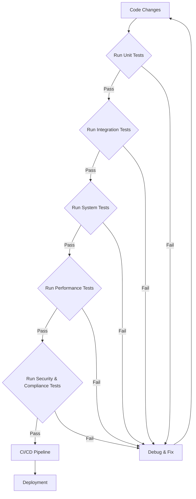

## Debug and Test Plan for ISA Project

### 1. Debugging Strategies

#### 1.1. Logging and Monitoring
*   **Centralized Logging**: Implement a robust logging mechanism across all components to capture application flow, warnings, and errors.
*   **Agent Task History**: Utilize `isa/logs/agent_task_history.json` to track agent actions, task descriptions, and outcomes, providing a chronological record for debugging.
*   **Structured Logs**: Ensure logs are structured (e.g., JSON format) for easier parsing and analysis by monitoring tools.
*   **Real-time Monitoring**: Integrate with monitoring solutions to visualize logs, metrics, and system health in real-time.

#### 1.2. Error Handling and Exception Management
*   **Graceful Degradation**: Design components to handle errors gracefully, preventing cascading failures and providing informative feedback to users or other agents.
*   **Centralized Error Reporting**: Implement a system for centralized error reporting to quickly identify and triage issues.
*   **Custom Exception Classes**: Define custom exception classes for specific error scenarios to improve clarity and maintainability.
*   **Retry Mechanisms**: Implement intelligent retry mechanisms for transient errors in external service calls or network operations.

#### 1.3. Root Cause Analysis Techniques
*   **Log Analysis**: Systematically review logs (including `isa/logs/agent_task_history.json`) to pinpoint the sequence of events leading to an error.
*   **Stack Trace Examination**: Analyze stack traces to identify the exact location and context of exceptions.
*   **Reproducibility**: Document steps to reproduce bugs to ensure consistent debugging and validation of fixes.
*   **Isolation**: Isolate problematic components or modules to narrow down the scope of the issue.
*   **Hypothesis Testing**: Formulate and test hypotheses about the root cause of a bug.

#### 1.4. Use of `isa_debugger`
*   **Uncertainty and Validation Failures**: The `isa_debugger` will be invoked when the system detects uncertainty in outcomes or when validation checks (e.g., from `isa_validator.py`) fail.
*   **Automated Diagnosis**: `isa_debugger` will attempt to automatically diagnose issues by analyzing inputs, outputs, and internal states, routing relevant information for further investigation.

### 2. Testing Methodologies

#### 2.1. Unit Testing
*   **Scope**: Focus on individual functions, methods, or small components in isolation.
*   **Target Areas**:
    *   Individual functions/components within `src/ai/flows/` (e.g., `answer-gs1-questions.ts`, `detect-standard-errors.ts`).
    *   Reusable UI components in `src/components/` (e.g., `src/components/ui/button.tsx`, `src/components/features/ai-output-card.tsx`).
*   **Purpose**: Verify that each unit of code performs as expected according to its specifications.

#### 2.2. Integration Testing
*   **Scope**: Test the interactions and interfaces between different modules or services.
*   **Target Areas**:
    *   Interactions between AI flows (`src/ai/`) and the application's frontend (`src/app/`).
    *   Data flow between `src/ai/tools/vector-store-tools.ts` and the actual vector database.
    *   Connectivity and data exchange with `dataconnect/` services.
*   **Purpose**: Ensure that integrated components work together correctly.

#### 2.3. System Testing (End-to-End Flows)
*   **Scope**: Test the complete, integrated system to evaluate its compliance with specified requirements.
*   **Target Areas**:
    *   Full user journeys within `src/app/(isa)/` (e.g., from input submission to AI response display).
    *   End-to-end data processing pipelines, including data ingestion, transformation, and storage.
*   **Purpose**: Validate the entire system's functionality from a user's perspective.

#### 2.4. Regression Testing
*   **Scope**: Re-run previously executed tests to ensure that new changes have not adversely affected existing functionalities.
*   **Trigger**: Performed after any code modification, bug fix, or new feature implementation.
*   **Automation**: Prioritize automation of regression test suites to enable frequent execution.

#### 2.5. Performance Testing
*   **Scope**: Evaluate the system's responsiveness, stability, scalability, and resource usage under various workloads.
*   **Metrics**: Measure response times, throughput, resource utilization (CPU, memory), and error rates.
*   **Target Areas**: AI model inference times, data retrieval from `dataconnect/` and vector stores, frontend rendering performance.

#### 2.6. Security Testing
*   **Scope**: Identify vulnerabilities and weaknesses in the system's security mechanisms.
*   **Reference**: Utilize insights from `docs/security/env_scan_summary_20250618.md` to inform security test cases, focusing on environment variable handling, secret management, and access controls.
*   **Techniques**: Penetration testing, vulnerability scanning, authentication and authorization testing.

#### 2.7. Compliance Testing
*   **Scope**: Verify that the system adheres to relevant industry standards, regulations, and internal policies.
*   **Reference**: Consult `docs/udm/08-Security-Compliance-Ethics.md` for specific compliance requirements and guidelines.
*   **Focus**: Data privacy, ethical AI guidelines, and regulatory adherence.

### 3. Test Case Categories

#### 3.1. Functional Tests
*   **Description**: Verify that each feature and function of the ISA application performs its intended purpose.
*   **Basis**: Derived directly from the features implemented in `src/app/(isa)/` (e.g., `src/app/(isa)/analysis/standards/page.tsx`, `src/app/(isa)/qa/page.tsx`).
*   **Examples**:
    *   Successful generation of formal descriptions from natural language.
    *   Accurate answering of GS1 questions using vector search.
    *   Correct detection of standard errors.

#### 3.2. Non-functional Tests
*   **Performance**: Test system behavior under load, stress, and varying network conditions.
*   **Security**: Test for unauthorized access, data breaches, and adherence to security policies.
*   **Usability**: Evaluate the user interface for ease of use, intuitiveness, and accessibility.

#### 3.3. Edge Case and Error Handling Tests
*   **Description**: Test how the system behaves under unusual, extreme, or invalid input conditions.
*   **Examples**:
    *   Empty inputs, malformed data, excessively long inputs.
    *   Network disconnections during API calls.
    *   Invalid configurations or missing environment variables.

#### 3.4. Data Integrity Tests
*   **Description**: Verify the accuracy, consistency, and reliability of data throughout its lifecycle within the system.
*   **Relevance**: Crucial for components interacting with `dataconnect/` and the vector data storage described in `isa/architecture/vector_data_storage.md`.
*   **Examples**:
    *   Ensuring data is correctly stored and retrieved from the vector database.
    *   Validating data transformations and consistency across different data sources.

### 4. Tools and Frameworks

*   **JavaScript/TypeScript**:
    *   **Jest**: For unit and integration testing of `src/ai/` flows and `src/components/` (e.g., React components).
    *   **React Testing Library**: For testing React components in `src/components/` in a user-centric way.
*   **Python**:
    *   **unittest/pytest**: For unit testing any Python scripts or modules within the project (e.g., `scripts/`).
*   **Validation Script**:
    *   `isa_validator.py`: This script will be run post-edit to validate consistency across the project, as per global instructions. Its output will be logged in `project_journal.md`.
*   **CI/CD Integration**:
    *   **Cloud Build**: The `devops 3/cloudbuild.yaml` configuration will be used to automate testing as part of the continuous integration and deployment pipeline.
    *   **Pipeline Visualization**: Refer to `ISA_CI_CD_Pipeline_Visualization.png` for an overview of the automated testing and deployment stages.

---

**Mermaid Diagram: High-Level Testing Flow**



**Mermaid Diagram: Debugging Workflow**

```mermaid
graph TD
    A[Issue Detected] --> B{Log Analysis};
    B --> C{Reproduce Issue};
    C --> D{Isolate Component};
    D --> E{Hypothesis & Test};
    E -- Fail --> F[Invoke isa_debugger];
    F --> G[Root Cause Identified];
    E -- Pass --> G;
    G --> H[Implement Fix];
    H --> I[Verify Fix];
    I -- Pass --> J[Close Issue];
    I -- Fail --> A;