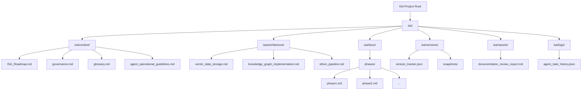

# Documentation Enhancement and Strategic Recommendations Plan

## Objective

To provide actionable recommendations for documentation enhancement, propose updates to global custom instructions, define new development tasks, and recommend a centralized documentation strategy, ensuring the ISA project's documentation is clear, consistent, complete, and aligned with its architectural vision and operational guidelines.

## Phase 1: Documentation Improvements

Based on the `documentation_review_report.md`, the following specific updates and additions are proposed:

1.  **Roadmap Consistency:**
    *   **Action:** Update [`docs/blueprint.md`](docs/blueprint.md) to expand the "Summary Roadmap Table" (Lines 334-339) to include all planned phases, specifically Phases 10-18, aligning with the scope indicated by `/ISA_Future_Phases_*` directories and other phase-specific READMEs.
    *   **New Documentation:** Create a dedicated, high-level `ISA_Roadmap.md` in [`isa/context/`](isa/context/) that serves as the single source of truth for the overall project roadmap, with `docs/blueprint.md` referencing it for the summary.

2.  **Architectural Detail Gaps:**
    *   **New Documentation:** Create detailed architectural design documents for critical Phase 2 components:
        *   `isa/architecture/vector_data_storage.md`: Detailing the chosen vector database service setup, Genkit tool implementation, and integration with `answerGs1QuestionsWithVectorSearch` flow.
        *   `isa/architecture/knowledge_graph_implementation.md`: Covering KG schema/ontology design, storage solution choice (AlloyDB AI or dedicated graph database), and initial ETL processes for populating the KG.
        *   `isa/architecture/eltvre_pipeline.md`: Documenting the architectural components and workflow for the robust and scalable data ingestion pipeline for GS1 standards documents.

3.  **Documentation Completeness:**
    *   **New Documentation:** Create a centralized glossary of key terms and acronyms in [`isa/context/glossary.md`](isa/context/glossary.md) to improve clarity and onboarding for new contributors. This glossary should define terms like ISA, GS1, GTIN, GLN, SSCC, GDSN, DPP, CSRD, LLM, RAG, NeSy, XAI, CoT, ToT, ELTVRE, KG, MLOps, CI/CD, TCO, RLAIF.
    *   **Review/Expand:** Review the content of [`isa/roo_modes.md`](isa/roo_modes.md). If it's a placeholder or lacks comprehensive details on each Roo mode's purpose, capabilities, and interaction protocols, expand it to be a definitive guide.

## Phase 2: Custom Instruction Updates

Formally propose changes to the global custom instructions to reflect the actual and intended paths of core documentation files, ensuring future operations are aligned and context restoration is accurate.

**Proposed Changes to Global Custom Instructions (Section 3: Context Restoration Before Changes):**

```diff
<<<<<<< SEARCH
     - Reload:
       - `isa/context/roadmap.md`
       - `isa/roo_modes.md`
       - `isa/config/roo_mode_map.json`
       - `isa_manifest.yaml`
=======
     - Reload:
       - `isa/context/ISA_Roadmap.md` (New centralized roadmap)
       - `isa/context/governance.md` (Centralized governance document)
       - `isa/context/ISA_Roo_Definitive_Architecture_v1.md` (Centralized architecture document)
       - `isa/roo_modes.md`
       - `isa/config/roo_mode_map.json`
       - `isa_manifest.yaml` (Confirm its consistent root location)
       - `isa/versions/version_tracker.json` (For versioning context)
>>>>>>> REPLACE
```

*   **Rationale:** These updates ensure that critical governance, architecture, and versioning documents are consistently reloaded, providing the agent with the most accurate and complete context before any major action. The `isa_manifest.yaml` path will be confirmed to be at the root.

## Phase 3: New Development Tasks

Based on identified gaps and inconsistencies from the `documentation_review_report.md` and user-provided examples, the following new development tasks are proposed for the Code or Architect modes:

1.  **Documentation Refactoring & Creation:**
    *   **Task:** Implement missing [`isa_manifest.yaml`](isa_manifest.yaml) or ensure its completeness and accuracy at the project root. (Mode: Architect/Code)
    *   **Task:** Refactor existing phase documentation (e.g., in `ISA_Future_Phases_*` directories) and consolidate into a single, discoverable location (e.g., `isa/docs/phases/`) with consistent naming conventions. (Mode: Architect/Code)
    *   **Task:** Address the discrepancy regarding `README.md` for Phase 12 (e.g., `ISA_Full_System_Export/ISA_Future_Phases/phase12/README.md` vs. other potential `README.md` files). Consolidate or clarify its purpose. (Mode: Architect/Code)
    *   **Task:** Integrate `VERSION.yaml` (e.g., `ISA_Future_Phases_Complete 2/docs/phases/VERSION.yaml`) into a centralized versioning strategy, potentially merging its content into `isa/versions/version_tracker.json` or defining a clear relationship. (Mode: Architect/Code)
    *   **Task:** Add detailed technical specifications for federated LLM nodes, including their interaction patterns, data exchange formats, and security considerations. (Mode: Architect)
    *   **Task:** Develop a dedicated document detailing the "Living Contracts" concept for Phase 9, including its technical implementation and integration points. (Mode: Architect)

2.  **Tooling & Automation Development:**
    *   **Task:** Develop a Python tool (`isa_doc_validator.py`) to validate documentation consistency (e.g., roadmap alignment, glossary adherence, broken links) across the project. (Mode: Code)
    *   **Task:** Implement automated enforcement mechanisms for mandatory post-edit logging, ensuring `CHANGELOG.md`, `isa/logs/agent_task_history.json`, and `isa/versions/version_tracker.json` are updated after every file modification or addition. This might involve Git hooks or CI/CD pipeline steps. (Mode: Code)
    *   **Task:** Integrate and document the execution of `isa_validator.py` and `isa_summarizer.py` within the project's CI/CD and local development workflows. (Mode: Code/Architect)
    *   **Task:** Implement automated snapshotting procedures after milestones (as defined in `CHANGELOG.md`) and a robust rollback mechanism to the last file-based snapshot upon validation failure. (Mode: Code/Architect)
    *   **Task:** Develop a prompt management system to enforce prompt structures and prevent prompt drift, potentially integrating with existing AI orchestration tools. (Mode: Code/Architect)

3.  **Agent Operational Documentation:**
    *   **Task:** Create a dedicated document (e.g., `isa/context/agent_operational_guidelines.md`) detailing agent-specific operational instructions such as "Context Restoration Before Changes," "Validate API Keys Before ISA Activation," "Use Boomerang for Incomplete Tasks," and "Escalate to isa_debugger if Uncertainty Detected." This document will serve as an internal guide for agent behavior. (Mode: Architect)

## Phase 4: Centralized Documentation Strategy

**Recommendation:** Consolidate core documentation files into a more centralized and consistent location within the `isa/` directory to simplify future context restoration, improve discoverability, and ensure adherence to custom instructions.

**Proposed Structure:**



*   **Rationale:** This structure centralizes critical project documentation, making it easier for agents and human contributors to locate, understand, and maintain. It aligns with the "Path Discipline" global custom instruction and streamlines the context restoration process. Existing documents like `docs/blueprint.md` can be updated to reference these new centralized locations.