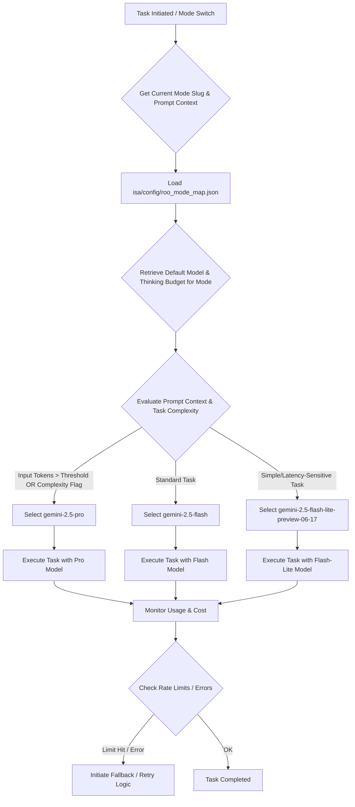

## Revised Plan for Gemini Model Optimization Integration

### 1. Updating Configuration Schemas

**Objective:** Modify `isa/config/roo_mode_map.json` to support `model` and `thinkingBudget` parameters for each mode, enabling dynamic model selection and budget control using Gemini 2.5 models.

**Proposed `isa/config/roo_mode_map.json` Structure:**

```json
{
  "modes": [
    {
      "slug": "architect",
      "name": "🏗️ Architect",
      "model": "gemini-2.5-pro",
      "thinkingBudget": -1,
      "description": "For deep reasoning, complex planning, and strategic design tasks."
    },
    {
      "slug": "code",
      "name": "💻 Code",
      "model": "gemini-2.5-flash",
      "thinkingBudget": 5000,
      "description": "For routine development, feature implementation, and refactoring."
    },
    {
      "slug": "ask",
      "name": "❓ Ask",
      "model": "gemini-2.5-flash-lite-preview-06-17",
      "thinkingBudget": 1000,
      "description": "For quick lookups, simple queries, and basic explanations."
    },
    {
      "slug": "debug",
      "name": "🪲 Debug",
      "model": "gemini-2.5-pro",
      "thinkingBudget": -1,
      "description": "For complex problem diagnosis, error investigation, and root cause analysis."
    },
    {
      "slug": "orchestrator",
      "name": "🪃 Orchestrator",
      "model": "gemini-2.5-pro",
      "thinkingBudget": -1,
      "description": "For task decomposition, subtask delegation, and multi-mode coordination."
    },
    {
      "slug": "claude-browser-mode-v2-0",
      "name": "Claude Browser Mode v2.0",
      "model": "gemini-2.5-flash",
      "thinkingBudget": 7000,
      "description": "For browser interactions, web research, and information gathering."
    }
  ],
  "mcpServers": []
}
```

**Explanation of Parameters:**

*   `slug`: Unique identifier for the mode.
*   `name`: Display name of the mode.
*   `model`: Specifies the preferred Gemini 2.5 model (`gemini-2.5-pro`, `gemini-2.5-flash`, `gemini-2.5-flash-lite-preview-06-17`).
*   `thinkingBudget`:
    *   `-1`: Indicates a dynamic budget, primarily for `gemini-2.5-pro`, allowing it to use its full reasoning capacity within reasonable limits.
    *   Positive Integer (e.g., `5000`, `1000`): Represents a fixed token budget for the model's response, enforcing cost and performance constraints.
    *   `0`: Can be used for `gemini-2.5-flash-lite-preview-06-17` to effectively disable extensive "thinking" for very direct, high-speed responses.
*   `description`: A brief explanation of the mode's purpose and its typical use cases.

### 2. Implementing Runtime Model Selection Logic

**Objective:** Design a mechanism for Roo to dynamically select the appropriate Gemini 2.5 model based on the current mode and task characteristics, incorporating dynamic switching logic.

**Proposed Logic Flow:**

1.  **Centralized Model Selection Module:** Introduce a core module (e.g., `isa/core/model_manager.py` or similar) responsible for loading the `roo_mode_map.json` and providing the appropriate model and thinking budget for the active mode.
2.  **Mode-Based Default Selection:** When a mode is activated or a new task is initiated within a mode, the `model_manager` will retrieve the `model` and `thinkingBudget` defined for that mode in `roo_mode_map.json`.
3.  **Dynamic Switching Logic (Based on Prompt Context):**
    *   The `model_manager` will evaluate the prompting context, including input token count, `task_intent`, and `expected_outcome`.
    *   A `threshold` for input token count (e.g., 20,000 tokens) will help determine complexity.
    *   Specific `complexity` flags (e.g., "architect", "indexer", "refactor") can be used to explicitly signal the need for a more powerful model.
    *   The system will dynamically switch models based on these criteria:
        *   **Simple tasks / Low latency / High volume / Rate-limit fallback:** `gemini-2.5-flash-lite-preview-06-17`
        *   **Standard tasks / Balanced speed and cost:** `gemini-2.5-flash` (workhorse model)
        *   **Complex tasks / Deep analysis / Architecture planning:** `gemini-2.5-pro`
    *   This dynamic switching logic will be implemented within the `model_manager` before delegating the task to the LLM.
4.  **Fallback Mechanism:** Implement robust error handling and fallback logic. If a preferred model is unavailable (e.g., API issues) or hits rate limits (HTTP 429 responses), the system should seamlessly switch to a backup model (e.g., Pro -> Flash -> Flash-Lite) or queue the request.
5.  **Prompt Caching:** Utilize Gemini's built-in prompt caching and explore storing commonly used prompts/responses for faster throughput, especially for `gemini-2.5-flash` and `gemini-2.5-flash-lite-preview-06-17`.

**Mermaid Diagram: Model Selection Flow (Revised)**



### 3. Incorporating Thinking Budgets

**Objective:** Apply `thinkingBudget` effectively for each model, enabling dynamic reasoning for Pro and fixed limits for Flash/Flash-Lite.

**Implementation Details:**

*   **API Integration:** The `thinkingBudget` value will be passed as a parameter to the underlying LLM API calls. The specific API parameter name will depend on the LLM client library used (e.g., `max_output_tokens`, `max_tokens`).
*   **Dynamic Budget (`-1` for Pro):** When `thinkingBudget` is `-1`, the system will allow `gemini-2.5-pro` to generate responses without a strict token limit, enabling deeper reasoning. However, internal monitoring will still track token usage to prevent excessive costs.
*   **Fixed Budgets (Flash/Flash-Lite):** For `gemini-2.5-flash` and `gemini-2.5-flash-lite-preview-06-17`, the specified integer value will act as a hard limit on the number of output tokens.
*   **Flash-Lite Thinking Enable/Disable:**
    *   A `thinkingBudget` of `0` for `gemini-2.5-flash-lite-preview-06-17` will signal the system to minimize internal reasoning steps, prioritizing speed and directness. This is ideal for tasks requiring quick, factual responses without complex thought processes.
    *   A small positive `thinkingBudget` (e.g., `100` or `200`) would allow for minimal reasoning while still being highly cost-effective.

### 4. Benchmarking and Monitoring Considerations

**Objective:** Outline strategies for evaluating model performance and managing costs post-integration.

**Benchmarking Strategy:**

*   **Task Suite Development:** Create a comprehensive suite of representative tasks for each Roo mode (e.g., a complex architectural design problem for `architect` mode, a code refactoring task for `code` mode, a simple factual query for `ask` mode).
*   **Controlled Experiments:** Run these tasks multiple times with different Gemini 2.5 models and varying `thinkingBudget` configurations.
*   **Metric Collection:** Collect the following metrics for each run:
    *   **Execution Time:** Time taken to complete the task.
    *   **Token Usage:** Input and output tokens consumed.
    *   **Cost:** Estimated cost per task based on token usage and model pricing.
    *   **Quality of Output:** Subjective or objective evaluation of the generated response's relevance, accuracy, and completeness.
*   **Reporting:** Store benchmarking results in a structured format (e.g., `isa/reports/model_benchmarking_results.json` or `isa/reports/model_benchmarking_results.md`) for analysis and tuning.

**Monitoring Methods:**

*   **API Usage Tracking:** Integrate with Google Cloud Logging and Monitoring to track Gemini API calls, token usage, and associated costs.
*   **Internal Logging:** Implement detailed logging within Roo to record which model was used for each task, the `thinkingBudget` applied, and the actual tokens consumed (`isa/logs/model_usage.log`).
*   **Cost and Performance Dashboard:** Develop a simple markdown-based dashboard (e.g., `isa/reports/cost_and_performance_dashboard.md`) to visualize trends in model usage, costs, and performance metrics over time.
*   **Alerting:** Set up alerts for:
    *   Approaching API rate limits.
    *   Exceeding predefined cost thresholds.
    *   Significant deviations in performance metrics.

### 5. Implications for ISA Development

**Objective:** Summarize the expected benefits and potential challenges of integrating these model optimization strategies.

**Expected Benefits:**

*   **Reduced Delays & Improved Responsiveness:** By leveraging `gemini-2.5-flash` and `gemini-2.5-flash-lite-preview-06-17` for routine and high-speed tasks, Roo can provide faster responses, leading to a more fluid and efficient development experience.
*   **Optimized Costs:** Strategically using cheaper models for less complex tasks will significantly reduce overall operational costs, making ISA development more sustainable.
*   **Scalable Thinking:** Reserving `gemini-2.5-pro` for critical, complex reasoning tasks ensures that Roo has the necessary intellectual horsepower when deep thought is required, without overspending on simpler operations.
*   **Enhanced Performance:** Matching the right model to the right task ensures optimal performance, as models are utilized for their strengths.
*   **Granular Control:** The `thinkingBudget` parameter provides fine-grained control over model behavior and resource consumption, allowing for precise tuning.

**Potential Challenges:**

*   **Configuration Complexity:** Managing the `roo_mode_map.json` and ensuring its consistency with evolving task requirements might introduce some overhead.
*   **Rate Limiting:** Aggressive use of Flash/Flash-Lite models could still hit rate limits, necessitating robust fallback and retry mechanisms.
*   **Task Classification Accuracy:** The effectiveness of dynamic model selection relies on accurately classifying task complexity. Misclassification could lead to suboptimal model choices (e.g., using a Flash-Lite for a complex reasoning task).
*   **Benchmarking Overhead:** Initial effort will be required to set up and run comprehensive benchmarks to tune `thinkingBudget` values and validate model choices.
*   **Debugging Complexity:** Issues related to model selection, budget constraints, or unexpected model behavior might be more complex to debug.